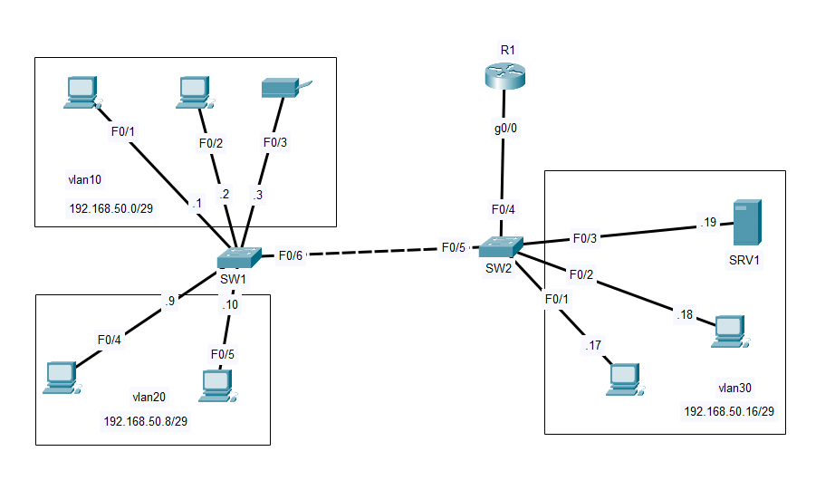
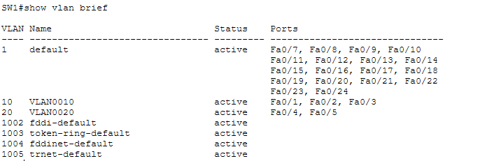
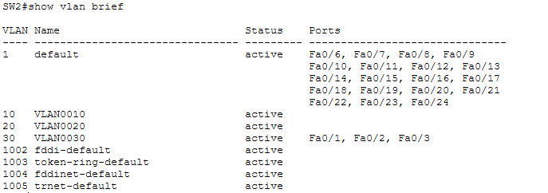
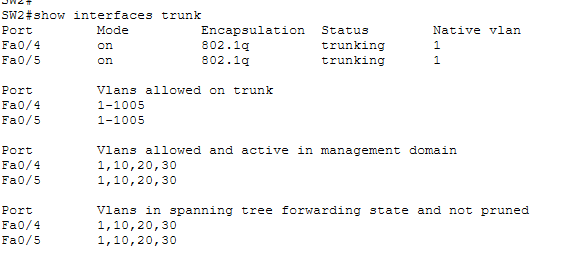
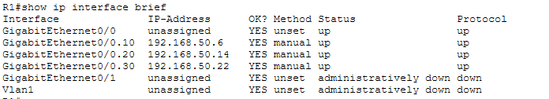
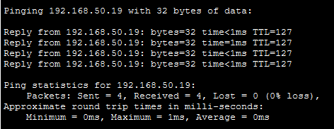

# 🌐 Project 2 – VLAN-Based Office Network using Router-on-a-Stick (ROAS)

## 📖 Project Overview

This project demonstrates the design and implementation of a VLAN-based small office network using **Cisco Packet Tracer**. Three departments—**HR**, **Sales**, and **IT**—are logically separated using VLANs while maintaining communication through **Router-on-a-Stick (ROAS)**.

The project focuses on implementing VLAN segmentation, IEEE 802.1Q trunking, router sub-interfaces, and inter-VLAN routing to create a secure and scalable office network.

---

## 🎯 Objectives

* Design a small office network with three departments.
* Create VLANs for each department.
* Configure access and trunk ports.
* Implement Router-on-a-Stick (ROAS) for inter-VLAN routing.
* Configure IP addressing for all end devices.
* Enable communication between all VLANs.
* Verify successful connectivity using ICMP ping tests.

---

## 🖥️ Network Topology



The network consists of:

* 1 Cisco Router
* 2 Cisco Switches
* 2 HR PCs
* 2 Sales PCs
* 2 IT PCs
* 1 Network Printer
* 1 Server

---

## 🏢 VLAN Configuration

| Department | VLAN ID | Network          |
| ---------- | :-----: | ---------------- |
| HR         |    10   | 192.168.50.0/29  |
| Sales      |    20   | 192.168.50.8/29  |
| IT         |    30   | 192.168.50.16/29 |

### Switch 1 VLAN Verification




### Switch 2 VLAN Verification





---

## 🌐 IP Addressing

Each VLAN uses an independent subnet.

* HR VLAN: 192.168.50.0/29
* Sales VLAN: 192.168.50.8/29
* IT VLAN: 192.168.50.16/29

Each subnet uses its router sub-interface as the default gateway.

---

## 🔀 Trunk Configuration

IEEE 802.1Q trunking is configured between networking devices to allow multiple VLANs to traverse a single physical connection.

### Trunk Verification



---

## 🚀 Router-on-a-Stick (ROAS)

Router-on-a-Stick is implemented using router sub-interfaces with IEEE 802.1Q encapsulation.

Each VLAN is assigned a dedicated router sub-interface to enable inter-VLAN communication.

### Router Sub-Interface Verification




---

## 🛠️ Technologies Used

* Cisco Packet Tracer
* IPv4 Addressing
* Subnetting
* VLANs
* Access Ports
* IEEE 802.1Q Trunking
* Router-on-a-Stick (ROAS)
* Inter-VLAN Routing
* ICMP Connectivity Testing

---

## 💻 Devices Used

| Device          | Quantity |
| --------------- | :------: |
| Cisco Router    |     1    |
| Cisco Switch    |     2    |
| PCs             |     6    |
| Server          |     1    |
| Network Printer |     1    |

---

## ⚙️ Configuration Summary

The following tasks were completed during the implementation:

* Created VLAN 10, VLAN 20, and VLAN 30.
* Assigned switch access ports to the appropriate VLANs.
* Configured trunk links between switches and the router.
* Configured router sub-interfaces for each VLAN.
* Enabled IEEE 802.1Q encapsulation.
* Assigned gateway IP addresses to each VLAN.
* Configured static IP addresses for all end devices.
* Configured default gateways.
* Verified end-to-end connectivity.

---

## 🔍 Verification Commands

The following Cisco IOS commands were used to verify the configuration:

```bash
show vlan brief
show interfaces trunk
show ip interface brief
show running-config
show ip route
ping
```

---

## ✅ Connectivity Testing

Connectivity was successfully verified between:

* HR PC → HR Printer
* HR PC → Sales PC
* Sales PC → IT PC
* IT PC → Server
* HR PC → Server
* Sales PC → Server
* Communication between all VLANs

### Ping Verification



Successful ping responses confirmed that inter-VLAN routing was functioning correctly.

---


## 📚 Skills Demonstrated

* IPv4 Addressing
* Subnetting
* VLAN Configuration
* Access Port Configuration
* IEEE 802.1Q Trunking
* Router-on-a-Stick (ROAS)
* Inter-VLAN Routing
* Router Sub-Interface Configuration
* Network Design
* Network Verification
* Basic Troubleshooting

---

## 📌 Project Status

**Completed**

This project successfully demonstrates the implementation of a VLAN-based office network using Router-on-a-Stick (ROAS), providing secure network segmentation while enabling communication between departments through inter-VLAN routing.


## Author

Dhanush.V

Computer Science Engineer
